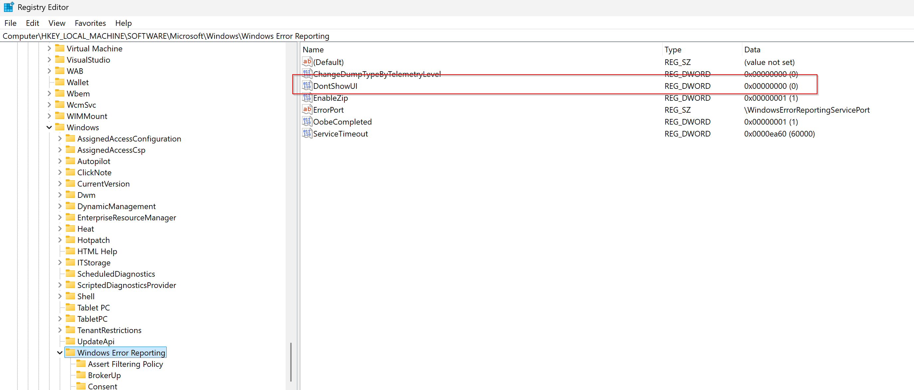

# procdump_examples

## Features

Program need to be built with debug information.
```json
"cacheVariables": {
    "CMAKE_BUILD_TYPE": "Debug"
}
```

It works with both GCC and VisualStudio! (program have to has a GUI)

LLDB can also debug GCC/VS crash dumps! (bt)

WinDbg can also show line info for Exception with GCC-built exe! (double click)

CodeLLDB can also show line info for VS crash dumps! (hit `pause`)

```json
{
    "type": "lldb",
    "request": "launch",
    "name": "Custom launch",
    "targetCreateCommands": [
        "target create ${workspaceFolder}/access_violation/build-debug/demo.exe --core C:/dumps/demo.exe(1).42140.dmp"
    ],
    "processCreateCommands": [
        "settings set target.run-args value1 value2 value3",
    ]
},
```

## Enable Windows Error Reporting

Show UI



Check group policy


check service running


## Resuslt


## References

[Windows Error Reporting][1]

[analyze core dump using lldb][2]

[WinDbg and ProcDump][3] (also watch related videos)

[CodeLLDB analyze core dump][4]

[1]: https://learn.microsoft.com/en-us/troubleshoot/windows-client/system-management-components/windows-error-reporting-diagnostics-enablement-guidance
[2]: https://learn.microsoft.com/en-us/troubleshoot/developer/webapps/aspnetcore/practice-troubleshoot-linux/lab-1-2-analyze-core-dumps-lldb-debugger
[3]: https://learn.microsoft.com/en-us/shows/defrag-tools/10-procdump-triggers
[4]: https://github.com/vadimcn/codelldb/blob/master/MANUAL.md#inspecting-a-core-dump
